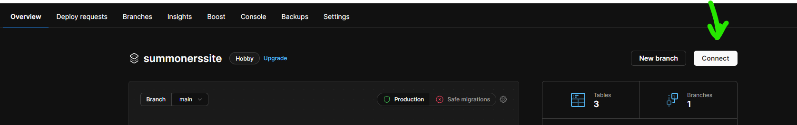
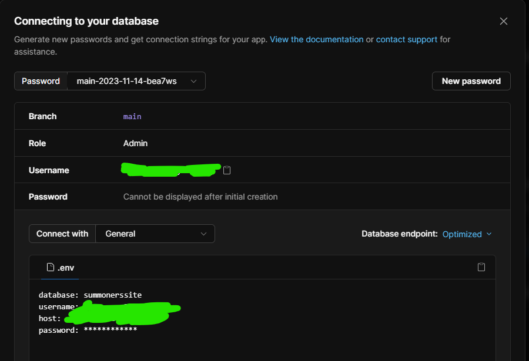

# summonerssite

Website where gamers share and rate League of Legends memes and fanart with each other. CPSC 332 Project.

## Tech Stack

Front-end: React
Back-end: Express.js
Database: MySQL

## Setup

First, install MySQL and set it up for use. Then, create a database (you can use any name you want). Keep track of the port number and the username/password used to access the database.

Then, create a `.env` file in `client`[^1]. Copy and paste the content from `.env.example` and insert your values.

> NOTE: When using PlanetScale as your main MySQL provider, make sure you click "General" when selecting options for "Connect with" after clicking "Connect". See below for visual guidance.

## Running the Project

First, run `npm install`

Then, run `npm run dev` to run the project locally.

## Footnotes

[^1]: It is not really ideal to place `.env` in `client`, but given the current project structure, it is necessary to do so. The project structure will most likely change in the near future.
